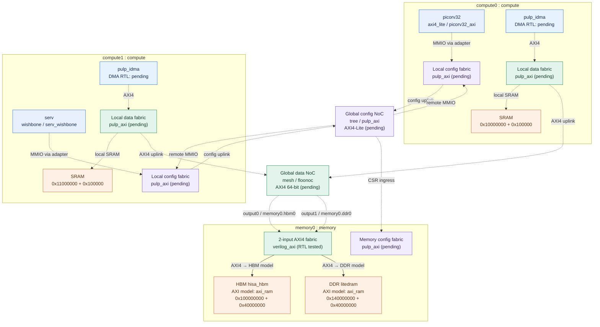

# Architecture

Generated from `config/soc.yaml`. Do not edit.

```mermaid
flowchart TB
  classDef cpu fill:#e8f0fe,stroke:#2869c9,color:#172a4b,stroke-width:1px;
  classDef dma fill:#e7f2ff,stroke:#2869c9,color:#172a4b,stroke-width:1px;
  classDef fabric fill:#e3f4ec,stroke:#20824e,color:#153c26,stroke-width:1px;
  classDef memory fill:#fff0e6,stroke:#c46b2f,color:#563115,stroke-width:1px;
  classDef config fill:#f1edff,stroke:#7654b5,color:#342451,stroke-width:1px;
  classDef verification fill:#e3f4ec,stroke:#20824e,color:#153c26,stroke-width:1px;
  classDef model fill:#f2f2f2,stroke:#888888,color:#333333,stroke-width:1px;
  subgraph box_compute0["compute0 : compute"]
    direction TB
    compute0_cpu["picorv32<br/>axi4_lite / picorv32_axi"]:::cpu
    compute0_dma["pulp_idma<br/>DMA RTL: pending"]:::dma
    compute0_local_data["Local data fabric<br/>pulp_axi (pending)"]:::fabric
    compute0_local_config["Local config fabric<br/>pulp_axi (pending)"]:::config
    compute0_sram["SRAM<br/>0x10000000 + 0x100000"]:::memory
  end
  subgraph box_compute1["compute1 : compute"]
    direction TB
    compute1_cpu["serv<br/>wishbone / serv_wishbone"]:::cpu
    compute1_dma["pulp_idma<br/>DMA RTL: pending"]:::dma
    compute1_local_data["Local data fabric<br/>pulp_axi (pending)"]:::fabric
    compute1_local_config["Local config fabric<br/>pulp_axi (pending)"]:::config
    compute1_sram["SRAM<br/>0x11000000 + 0x100000"]:::memory
  end
  subgraph box_memory0["memory0 : memory"]
    direction TB
    memory0_local_data["2-input AXI4 fabric<br/>verilog_axi (RTL tested)"]:::fabric
    memory0_local_config["Memory config fabric<br/>pulp_axi (pending)"]:::config
    memory0_hbm0["HBM hisa_hbm<br/>AXI model: axi_ram<br/>0x100000000 + 0x40000000"]:::memory
    memory0_ddr0["DDR litedram<br/>AXI model: axi_ram<br/>0x140000000 + 0x40000000"]:::memory
  end
  global_data["Global data NoC<br/>mesh / floonoc<br/>AXI4 64-bit (pending)"]:::fabric
  global_config["Global config NoC<br/>tree / pulp_axi<br/>AXI4-Lite (pending)"]:::config
  compute0_cpu -.->|MMIO via adapter| compute0_local_config
  compute0_dma -.->|AXI4| compute0_local_data
  compute0_local_data -.->|local SRAM| compute0_sram
  compute0_local_data -.->|AXI4 uplink| global_data
  compute0_local_config -.->|config uplink| global_config
  compute1_cpu -.->|MMIO via adapter| compute1_local_config
  compute1_dma -.->|AXI4| compute1_local_data
  compute1_local_data -.->|local SRAM| compute1_sram
  compute1_local_data -.->|AXI4 uplink| global_data
  compute1_local_config -.->|config uplink| global_config
  memory0_local_data -->|AXI4 → HBM model| memory0_hbm0
  memory0_local_data -->|AXI4 → DDR model| memory0_ddr0
  global_config -.->|CSR ingress| memory0_local_config
  global_data -.->|output0 / memory0.hbm0| memory0_local_data
  global_data -.->|output1 / memory0.ddr0| memory0_local_data
  global_config -.->|remote MMIO| compute0_local_config
  global_config -.->|remote MMIO| compute1_local_config
  %% Dashed links = planned full-chip integration; solid links = memory model RTL scope.
```
